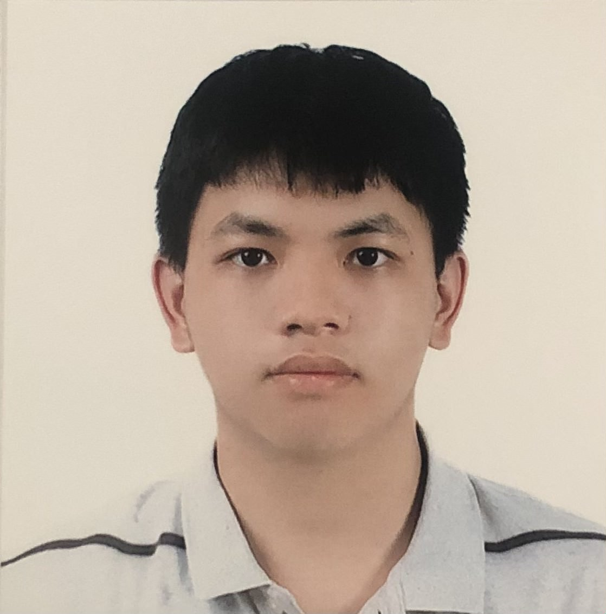

[View the Project on GitHub](https://github.com/kienngo-pyth/Kien-Ngo)

# ABOUT ME

Hi there! I'm Kien Ngo 👋, a Mathematics junior at the University of North Carolina - Chapel Hill, specializing in Data Analytics and Python programming.

# WHAT I DO

- 📊 **Data Analytics & Research** 
- 📐 **Mathematical Modeling**

# HOW TO REACH ME
- Email: [ngochikien0309@gmail.com](mailto:ngochikien0309@gmail.com)[cite: 1]

# MY PORTFOLIO
- Past projects
  + [Analyzing the Effectiveness of Penalty Kick Strategies in Association Football](https://docs.google.com/document/d/1_J0-H1V8b2tFzgC7_0UhRtTrglWRzOkS/edit?usp=sharing)
    * The project examined the relative effectiveness in scoring penalties of keeper-dependent strategies in comparison with the more traditional keeper-independent strategy, as well as exploring other factors
    * Used random samples of penalty kicks between 2014 and 2023; I manually collected the samples, which have different scenarios between them
    * Key finding: neither type of strategy has an edge over the other
  + [Torque Control of IPMSM Motors Using RLAgent Algorithm](https://app.luminpdf.com/vi/viewer/65840584d9957f7d00e696c6)
    * The project looked into torque and torque improvement using reinforcement learning in IPMSM motors.
    * My team collected and cleaned data for each experiment; from those data points, we established equations pertaining to motor physics. We used the equations in conjunction with data to compare motor torque in different stages of reinforcement learning.
  + [90 Math Problems for Olympic Training](https://sg.docworkspace.com/d/sIAqpoOC2Acvo-aKG)
    * I wrote a training book for students participating in the International Mathematical Olympiad (IMO), under the guidance of Prof. Nguyen Minh Duc.
    * The book covers a variety of Math problems such as trigonometry equations and limits of a number sequence.
    * 250+ copies of the book were gifted to secondary school students in Hanoi intending to specialize in Math.
- Past work experience
  + At VNPT - Qualcomm Center of Excellence (Hanoi, Vietnam)
    * Developed an AI-powered detection tool using Python to find signs of churning among customers of the company’s service provider. Found 5,000+ accounts close to churning among 100,000 accounts.
    * Worked with fine-tuning the model, which used Gradient Boosting.
    * The project resulted in a model with ~95% recall and ~32% precision.
  + As AI Project Intern at Techcombank (Hanoi, Vietnam)
    * Detected 110,000+ fraudulent transactions by developing an AI-powered fraud detection tool in mobile banking using Python.
    * Participated in daily planning sessions and work with fine-tuning the model used for prediction, which uses the AdaBoost algorithm.
    * The project resulted in a model with ~91% recall and ~45% precision.
